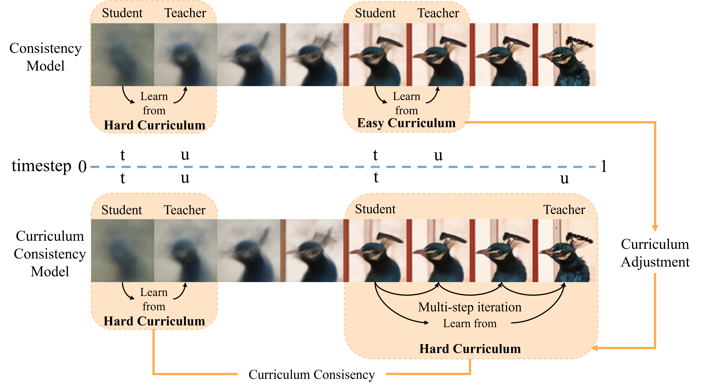
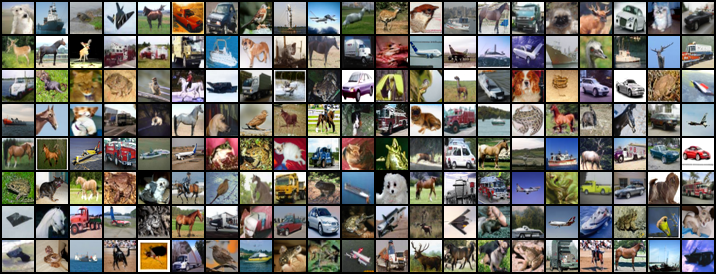
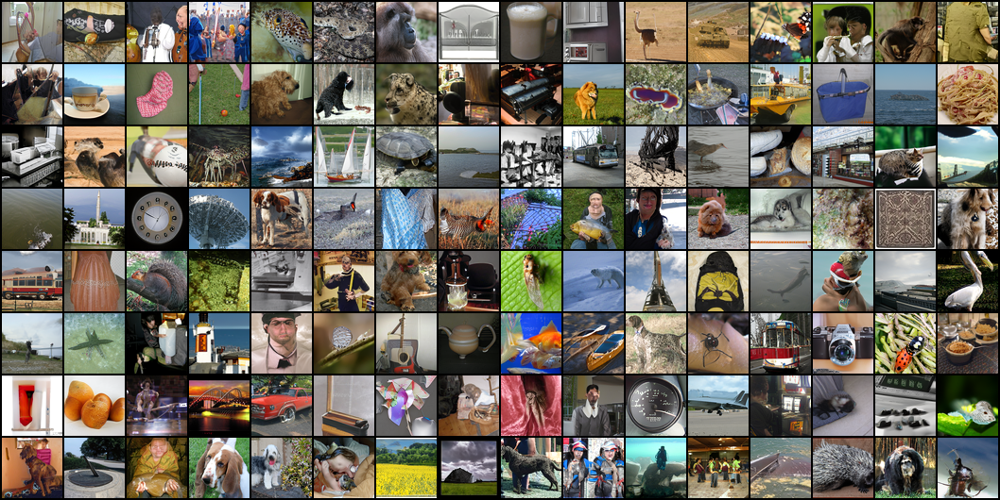

# 🖌️ CVPR 2025 | Curriculum Consistency Model

[](https://arxiv.org/abs/2412.06295)

This repository contains the implementation of the CVPR2025 paper "[See Further When Clear: Curriculum Consistency Model](https://arxiv.org/abs/2412.06295)".



Samples generated by CCM (NFE=1) trained on CIFAR-10.


Samples generated by CCM (NFE=1) trained on ImageNet 64x64 according to random classes.



## 🚀 News
**Jan 15, 2026**:fire:
- We have released the training code for ccm on cifar10.
- We have open-sourced the model weights for ImageNet64 (FID=2.18).

**Aug 5, 2025**:fire:

- We have open-sourced the model weights for CIFAR-10 (FID=1.64).

## Get Started

**Recommend Environment:** `cuda 12.1` + `python 3.9`

```bash
# Clone the Repository
git clone git@github.com:Dreamern/ccm.git

# Create Virtual Environment with Conda
conda create --name ccm python=3.9
conda activate ccm

# Install Dependencies
pip install -r requirements.txt
```
## Dataset Preparation
The dataset [cifar-10-python.tar.gz](https://www.cs.toronto.edu/~kriz/cifar-10-python.tar.gz) will be automatically downloaded during runtime, or it can be manually placed in `data`.

## Training
Download and place the teacher model [otcfm_cifar10_weights_step_400000.pt](https://drive.google.com/file/d/1N0-kT2phDKQVJ5I65fyZopCixUeX-8xU/view?usp=drive_link) weights into `results/fm/otcfm/cifar10` and run the following command.

```shell
bash train_ccm_cifar10.sh $gpu_num
```
or
```shell
#!/bin/bash
torchrun --nproc_per_node=$gpu_num --master_port=29505 train_ccm.py \
    --model otcfm \
    --output_dir results/ccm \
    --lr 2e-4 \
    --total_steps 300001 \
    --warmup 5000 \
    --batch_size 128 \
    --save_step 20000 \
    --resume null \
    --dataset cifar10 \
    --kdc 65 \
    --gan_start 100000 \
    --alpha 2 \
    --loss_type 224 \
    --cm_type cd \
    --timestep_size 0.03 \
    --teacher results/fm/otcfm/cifar10/otcfm_cifar10_weights_step_400000.pt
```

## Evaluation

Place your model weights into the `ckpts` directory. We have already provided the weights for [cifar10](https://drive.google.com/file/d/1bG7VIx_hU-GOm3esQ_xhztqv7k0VpE0R/view?usp=drive_link) and [imagenet64](https://drive.google.com/file/d/1Qtq6qX8C5fg0j9xCFGgNPyZet06yWmGM/view?usp=drive_link).

Download the [inception-2015-12-05.pt](https://drive.google.com/file/d/1fDu24oXm3Xl_KEXzToIpNv2Mv28vrLAe/view?usp=drive_link) file to the `/tmp` directory.

Download [cifar10_legacy_tensorflow_train_32.npz](https://drive.google.com/file/d/14OE52Ek-EqbdgI93z4gICGVd8BBP3P4N/view?usp=drive_link) and [imagenet-64x64.npz](https://drive.google.com/file/d/1mB9pFaU0KV-8xwKIR9-4K-3KnbzUjKQP/view?usp=drive_link) into the `assets` directory.

Then you can compute the fid for CCM by running the following command:

```bash
bash eval.sh $gpu_num $ckpt_path $task $dataset

# eval on cifar10
bash eval.sh 1 ckpts/otcfm_cifar10.pt fid cifar10

# sample on cifar10
bash eval.sh 1 ckpts/otcfm_cifar10.pt gen cifar10
```

## Contact Us

**Yunpeng Liu**: lypniuyou@163.com

## BibTeX

```
@inproceedings{liu2025see,
  title={See Further When Clear: Curriculum Consistency Model},
  author={Liu, Yunpeng and Liu, Boxiao and Zhang, Yi and Hou, Xingzhong and Song, Guanglu and Liu, Yu and You, Haihang},
  booktitle={Proceedings of the Computer Vision and Pattern Recognition Conference},
  pages={18103--18112},
  year={2025}
}
```

## Thanks
A Large portion of this codebase is built upon [torchcfm](https://github.com/atong01/conditional-flow-matching/tree/main) and [ctm](https://github.com/sony/ctm).